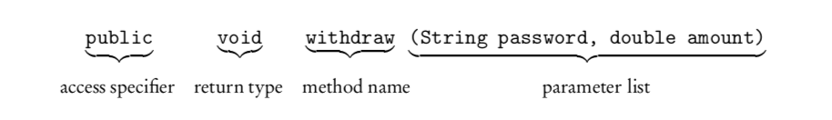
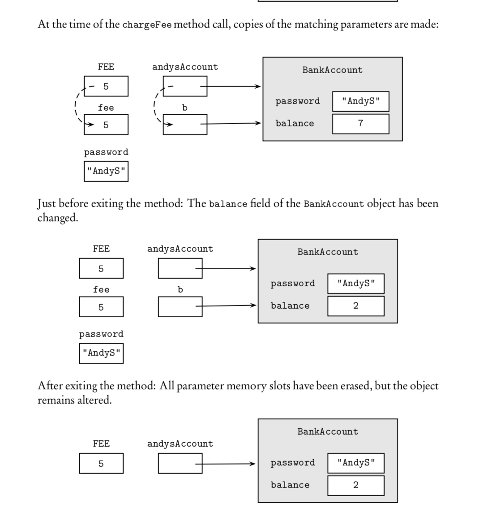

# Classes and Objects
## Objects
* Objects are things that we program to describe. For example: a book, a person...
* A object is charatered by its state and behavior.
* In Java, a variable that represents an object is called an object reference.
## Classes
* A class is a software blueprint for implementing objects of a given type.
* An object is a single instance of the class.
```Java
public class BankAccount {

private String password;
private double balance;
public static final double OVERDRAWN_PENALTY = 20.00;

//constructors
/** Default constructor.
* Constructs bank account with default values. */
public BankAccount()
{ /* implementation code */ }

/** Constructs bank account with specified password and balance. */
public BankAccount(String acctPassword, double acctBalance)
{ /* implementation code */ }

//accessor
/** @return balance of this account */
public double getBalance()
{ /* implementation code */ }

//mutators
/** Deposits amount in bank account with given password.
* @param acctPassword the password of this bank account
* @param amount the amount to be deposited */
public void deposit(String acctPassword, double amount)
{ /* implementation code */ }

/**Withdraws amount from bank account with given password.
* Assesses penalty if balance is less than amount.
* @param acctPassword the password of this bank account
* @param amount the amount to be withdrawn
*/
public void withdraw(String acctPassword, double amount){
{ /* implementation code */ }
}
}
```
## Public, Private, and Static
### Public
The keyword public preceding the class declaration signals that the class is usable by all client programs. If a class is not public, it can be used only by classes in its own package. In the AP Java subset, all classes are public.
### Private
 Restriction of access is known as information hiding. In Java, this is implemented by using the keyword private. Private methods and vari- ables in a class can be accessed only by methods of that class.
 ### Static
 A static variable (class variable) contains a value that is shared by all instances of the class. “Static” means that memory allocation happens once.The keyword static indicates that there is a single value of the variable that applies to the whole class, rather than a new instance for each object of the class.
 
 Typical uses of a static variable are to
 
 * keep track of statistics for objects of the class.
 *  accumulate a total.
 * provide a new identity number for each new object of the class.
 
 For example:
 ```Java
 public class Employee {
 private String name;
 private static int employeeCount = 0; //number of employees
 public Employee( < parameter list > ) {
 < initialization of private instance variables >
 employeeCount++; //increment count of all employees }
 ... }
 ```
 
 ## Methods
 ### Headers


### Constructors
A constructor creates an object of the class.
```Java
/** Default constructor.
* Constructs a bank account with default values. */
public BankAccount() {
password = "";
balance = 0.0;
}
```
### Accessors
An accessor method accesses a class object without altering the object.
```Java
/** @return the balance of this account */
public double getBalance()
{ return balance; }
```
### Mutators
A mutator method changes the state of an object by modifying at least one of its in- stance variables.
```Java
public void deposit(String acctPassword, double amount) {
if (!acctPassword.equals(password)) /* throw an exception */
else
balance += amount;
}
```
### Static Methods
* Static Methods vs. Instance Methods
A method operate on individual objects of a class is called *instance methods*.
A method that performs an operation for the entire class, not its individual objects, is called a *static method* (sometimes called a class method).

* Static Methods in a Driver Class
Main: static since it's unique and it's not related to the instances.
We can call main function in another main function.

### Method Overloading
Overloaded methods are two or more methods in the same class that have the same name but different parameter lists.

## Scope
* The scope of a variable or method is the region in which that variable or method is visible and can be accessed.
* A local variable is defined inside a method.
* A block is a piece of code enclosed in a {} pair.

### The *this* Keyword
An instance method is always called for a particular object. This object is an implicit parameter for the method and is referred to with the keyword this.

## References
### References vs. Primitive Data Types
primitive value: passed as value
reference value: passed as address

### Method Parameters
#### Formal vs. Actual Parameters
The header of a method defines the parameters of that method.
* *Formal Parameters* exits as the headers.
* *Actual Parameters* are the actual data.

#### Passing Primitive Types as Parameters
Any changes made to the parameters will not affect the values of the arguments in the calling program.
```Java
public class ParamTest {
public static void foo(int x, double y) {
x = 3;
y = 2.5; }
public static void main(String[] args) {
int a = 7;
double b = 6.5;
foo(a, b);
System.out.println(a + " " + b);
} }
```
The output will be 7 6.5

#### Passing Obejects as Parameters
It is, however, possible to change the state of the object to which the parameter refers through methods that act on the object.
```Java
A method that changes the state of an object.
/** Subtracts fee from balance in b if current balance too low. */ public static void chargeFee(BankAccount b, String password,
double fee)
{
final double MIN_BALANCE = 10.00; if (b.getBalance() < MIN_BALANCE)
b.withdraw(password, fee);
}
public static void main(String[] args) {
final double FEE = 5.00;
BankAccount andysAccount = new BankAccount("AndyS", 7.00); chargeFee(andysAccount, "AndyS", FEE);
... }
```



